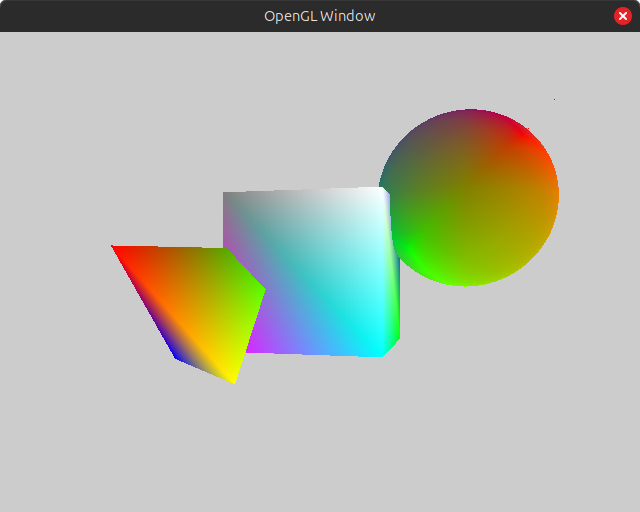

# GLbasics

## Overview
**GLbasics** is a basic 3D graphics simulation using OpenGL. The project demonstrates fundamental OpenGL concepts such as rendering 3D objects, transformations, and camera controls. It serves as a starting point for learning OpenGL and experimenting with real-time graphics rendering.

## Features
- **3D Object Rendering** - Displays basic 3D objects (cubes, spheres, planes, etc.).
- **Camera Control** - Move and rotate the camera using keyboard and mouse inputs.
- **Transformations** - Supports translation, rotation, and scaling of objects.

## Installation
### Prerequisites
Ensure you have the following installed:
- OpenGL (>= 3.3 recommended)
- GLFW (for window and input management)
- GLAD (for OpenGL function loading)
- GLM (for mathematics operations)

### Clone the Repository
```bash
https://github.com/yCount/GLbasics
cd OpenGL-Sim
```


### Build and Run

```bash
make
./prog
```

## Controls
- **W/A/S/D** – Move camera forward, left, backward, right
- **Mouse Drag** – Rotate camera
- **Shift/Ctrl** – Move camera up/down
- **Ctrl+E** – Exit simulation
---
